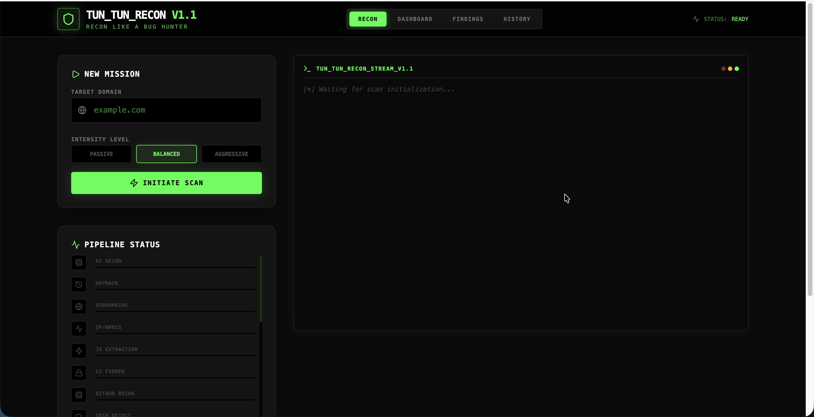

---

```markdown
# 🛡️ TUN_TUN_RECON v1.1
### Advanced Reconnaissance & Vulnerability Discovery Engine

<p align="center">
  
</p>


---

## 📑 Table of Contents

- Overview
- Features
- Recon Modules
- Operational Workflow
- Installation
- Usage
- Scan Intensity Levels
- Output Structure
- Contributing
- Legal Disclaimer

---

# 🚀 Overview

**TUN_TUN_RECON** is an **advanced reconnaissance and vulnerability discovery framework** designed for **bug bounty hunters, penetration testers, and red teamers**.

The framework automates **deep intelligence gathering** by orchestrating **30 specialized reconnaissance and vulnerability detection modules** that transform a **single domain into a structured map of actionable security intelligence**.

The engine moves through multiple reconnaissance phases:

```

Passive OSINT → Surface Mapping → Endpoint Discovery → Vulnerability Analysis

````

This helps security researchers uncover:

- Forgotten infrastructure
- Shadow assets
- Exposed secrets
- Misconfigurations
- Low-hanging vulnerabilities

---

# ⚡ Key Features

✔ Automated **30-module reconnaissance framework**  
✔ Passive + Active intelligence gathering  
✔ JavaScript secret discovery  
✔ Hidden API endpoint detection  
✔ Parameter discovery & fuzzing  
✔ Subdomain takeover detection  
✔ CVE scanning with Nuclei  
✔ Structured JSON output for reporting  
✔ Severity-based vulnerability classification  

---

# 🛠️ Recon Modules (30-Point Inspection)

`TUN_TUN_RECON` integrates multiple powerful reconnaissance tools grouped into **three operational phases**.

---

# 1️⃣ Infrastructure & Attack Surface Mapping

### Subdomain Discovery

Passive DNS enumeration using:

- `crt.sh`
- AlienVault OTX
- Subfinder logic

Helps discover:

- Hidden subdomains
- Legacy infrastructure
- Forgotten assets

---

### Cloud & Repository Recon

Includes:

- **S3 bucket discovery**
- **GitHub dorking**
- **Credential leak detection**

Targets:

- AWS buckets
- Public repositories
- API secrets in code

---

### DNS & Network Mapping

Full DNS intelligence gathering:

- A Records
- MX Records
- TXT Records
- CNAME Records
- Zone Transfer (AXFR)

---

### Historical Data Mining

Collects historical intelligence using:

- **Wayback Machine**
- Archived endpoints
- Historical `robots.txt`

---

# 2️⃣ Endpoint & Secret Intelligence

### JavaScript Intelligence

The framework scans JavaScript files to detect:

- Hidden API paths
- Internal endpoints
- Hardcoded secrets

Secret detection includes:

- AWS Keys
- JWT Tokens
- Stripe Keys
- API Keys

---

### Parameter Discovery

Hidden parameters are discovered using:

- **Arjun**
- **ParamMiner**

Detects:

- Hidden parameters
- Unlinked parameters
- Backend parameters

---

### API Discovery

Automatically detects exposed APIs:

- REST APIs
- GraphQL endpoints
- Swagger / OpenAPI documentation

---

### LinkFinder Integration

Client-side script analysis helps map:

- Internal application routes
- Hidden endpoints
- API paths

---

# 3️⃣ Vulnerability Analysis

### Injection Detection

Integrated tools:

- **SQLMap** → SQL Injection
- **Commix** → Command Injection

---

### Automated Vulnerability Scanning

Includes:

- **Nuclei** → CVE scanning
- **Nikto** → Web server misconfiguration detection

---

### Web Security Testing

Automated checks include:

- **DalFox** → XSS detection
- CORS misconfiguration testing
- Cookie security validation

Cookie checks:

- Secure flag
- HttpOnly
- SameSite

---

### Infrastructure Risk Detection

The engine actively detects:

- **Subdomain Takeovers**
- **Dangling CNAME records**
- **Third-party service abandonment**

---

# 📊 Operational Workflow

The system processes every finding through a **structured intelligence pipeline**.

### 1️⃣ Detection

Recon modules identify a potential attack surface.

---

### 2️⃣ Evidence Collection

The system captures:

- URLs
- Parameters
- Endpoints
- Code snippets
- Secrets

---

### 3️⃣ Severity Classification

All findings are automatically categorized.

| Severity | Example |
|--------|--------|
| 🔴 CRITICAL | RCE, SQL Injection, Admin Credentials |
| 🟠 HIGH | SSRF, Subdomain Takeover |
| 🟡 MEDIUM | CORS Misconfiguration |
| 🔵 LOW | Missing Security Headers |
| ⚪ INFO | Technology Fingerprints |

---

# ⚙️ Installation

Clone the repository:

```bash
git clone https://github.com/yourusername/tun_tun_recon.git
````

Navigate to the directory:

```bash
cd tun_tun_recon
```

Run the setup script:

```bash
chmod +x setup.sh
./setup.sh
```

The setup script installs all required dependencies automatically.

---

# 🧠 Usage

Start a reconnaissance mission:

```bash
python3 tun_tun_recon.py -d example.com
```

---

# 🎯 Scan Intensity Levels

Users can choose the scanning intensity level.

### Passive Mode

* OSINT only
* No active scanning
* Stealth reconnaissance

---

### Balanced Mode (Recommended)

Best mode for **bug bounty hunting**.

Includes:

* Passive reconnaissance
* Parameter discovery
* API enumeration

---

### Aggressive Mode

Deep vulnerability scanning including:

* Active fuzzing
* Injection testing
* Full vulnerability scans

---

# 📂 Output Structure

All results are stored in the `output/` directory.

```
output/
 ├── subdomains.txt
 ├── endpoints.txt
 ├── parameters.txt
 ├── secrets.txt
 └── findings.json
```

Example `findings.json`

```json
{
  "severity": "HIGH",
  "type": "Subdomain Takeover",
  "target": "dev.example.com",
  "evidence": "CNAME pointing to unclaimed service"
}
```

---

# 🤝 Contributing

Contributions are welcome.

Steps to contribute:

1. Fork the repository
2. Create a new branch
3. Submit a Pull Request

---

# ⚖️ Legal Disclaimer

⚠️ **Important Notice**

This tool is intended strictly for:

* Authorized security testing
* Research
* Educational purposes

Unauthorized scanning of systems without permission may violate local laws and regulations.

The developers assume **no liability for misuse** of this tool.

---

# ⭐ Support the Project

If you find this tool useful:

⭐ Star the repository
🐛 Report issues
🛠️ Submit improvements

---

# 🧠 Author:

**Rajeshwar Singh**

Built for **Bug Hunters, Red Teamers, and Security Researchers**

Turning **domains into attack surface intelligence**.

```


